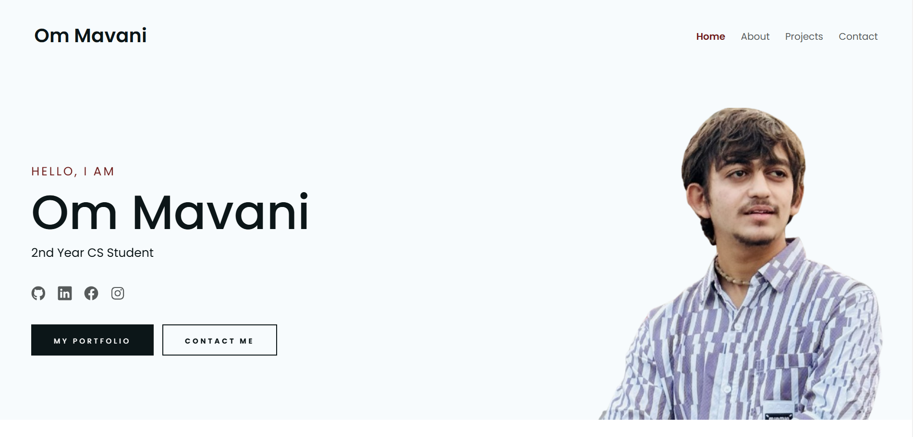

#  Portfolio Website



## Description

This is a very simple, but elegant responsive portfolio template built using plain JavaScript, HTML, and CSS. It’s designed to be easily customizable, allowing any developer to quickly create a personal portfolio site. Below you'll find detailed information about the features and how to use this template.

## Table of Contents

- About
- Project
- Contact

## Features

- **Responsive Design**
- **Single-page layout**
- **Simple and customizable**

## Live Preview

Check out the live preview of the Simple Developer Portfolio [here](https://om23aas.github.io/).

## Usage

To use this template, follow these steps:

1. **Clone the Repository**:
    ```bash
    git clone https://github.com/om23aas/om23aas.github.io.git
    ```
2. **Customize the Content**: Replace the placeholder content with your own details, including projects, skills, and contact information.
3. **Deploy**: Upload the project to GitHub Pages or any hosting platform of your choice.


## License

This project is licensed under the MIT License.
